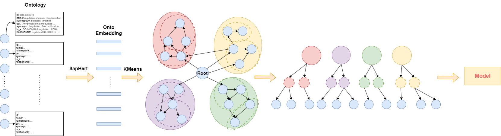

# HMCC  

## Overview  

**HMCC** is a neural network framework designed for multi-label prediction on microbial protein sequences. It integrates **ProtBert embeddings**, **Focal Loss with re-weighting**, and **frequency-aware sampling strategies** to address challenges posed by long-tail label distributions.  
For **Gene Ontology (GO) embedding**, refer to: [OWL2Vec-Star](https://github.com/KRR-Oxford/OWL2Vec-Star.git)  or you can refer to cluster_code.



---

## Installation  

Install dependencies using:  

```bash  
pip install -r requirements.txt  
```  

---

## Project Structure  

### Core Modules:  

- **`data2milvus.py`**  
  Encodes protein sequences using ProtBert and stores embeddings in a Milvus vector database.  

- **`freq/freqs.py`**  
  Computes label frequencies and calculates the α parameter for Focal Loss to mitigate class imbalance.  

- **`freq/get_high_low_indices.py`**  
  Identifies sample indices associated with high/low-frequency labels for targeted training.  

- **`MySampler.py`**  
  Custom sampler for frequency-aware sample selection.  

- **`train.py`**  
  Main training script (model setup, loss configuration, optimizer selection, and training loop).  

---

## Usage  

To start training, run:  
```bash  
accelerate launch --main_process_port 29501 \  
                  --config_file accelerate_config.yaml \  
                  --mixed_precision bf16 \  
                  train.py >> Prot_milvus.log  
```  

---
